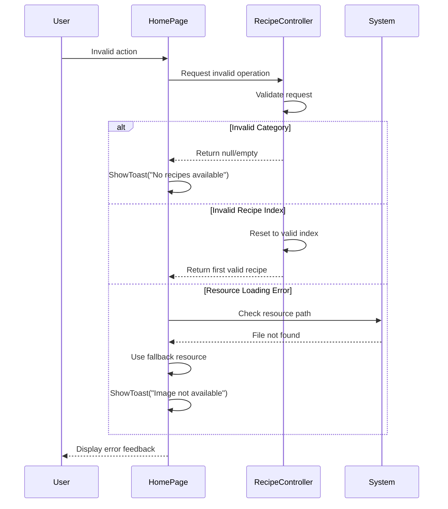

# Recipe Application - Sequence Diagram

## Main Application Flow

```mermaid
sequenceDiagram
    participant User
    participant Program as Program.cs
    participant Splash as SplashScreen
    participant Home as HomePage
    participant Menu as MenuPage
    participant RC as RecipeController
    participant MC as MenuController
    participant RM as RecipeModel
    participant MM as MenuItemModel

    Note over User, MM: Application Startup Flow
    
    User->>Program: Launch App
    activate Program
    Program->>Program: OnCreate()
    Program->>Splash: InitializeSplashScreen()
    activate Splash
    Program->>Splash: Show splash screen
    
    Note over Splash: Loading animation and initialization
    
    Splash-->>Program: OnSplashComplete()
    deactivate Splash
    Program->>Home: InitializeMainApp()
    activate Home
    Program->>Home: Create HomePage instance
    Home->>RC: RecipeController.Instance
    activate RC
    RC->>RC: InitializeRecipes()
    RC->>RM: Create RecipeModel instances
    activate RM
    RM-->>RC: Recipe data initialized
    deactivate RM
    RC-->>Home: Controller ready
    Home->>Home: Initialize UI components
    Home-->>Program: HomePage displayed
    deactivate RC
    
    Note over User, MM: User Interactions
    
    User->>Home: Touch carousel image
    Home->>Home: OnCarouselTouch()
    Home->>Home: NextCarouselImage()
    Home->>RC: GetNextRecipe()
    activate RC
    RC->>RC: Calculate next recipe index
    RC-->>Home: Next recipe data
    deactivate RC
    Home->>Home: UpdateCarouselContent()
    Home-->>User: Display updated recipe
    
    User->>Home: Touch category tab (Appetizers/Entrees/Desserts)
    Home->>Home: SwitchToCategory(categoryIndex)
    Home->>RC: SwitchCategory(category)
    activate RC
    RC->>RC: Update current category
    RC->>RC: Reset recipe index
    RC-->>Home: OnCategoryChanged event
    RC-->>Home: OnRecipeChanged event
    deactivate RC
    Home->>Home: UpdateCurrentCategoryData()
    Home->>Home: UpdateCarouselContent()
    Home->>Home: UpdateTabStyling()
    Home->>Home: ShowToast("Category switched")
    Home-->>User: Display new category content
    
    User->>Home: Touch menu button
    Home->>Home: ShowMenuPage()
    Home->>Menu: Create MenuPage instance
    activate Menu
    Menu->>MC: MenuController.Instance
    activate MC
    MC->>MC: InitializeMenuItems()
    MC->>MM: Create MenuItemModel instances
    activate MM
    MM-->>MC: Menu item data initialized
    deactivate MM
    MC-->>Menu: Controller ready
    Menu->>Menu: Initialize menu UI
    Menu-->>Home: Menu overlay displayed
    deactivate MC
    
    User->>Menu: Touch menu item
    Menu->>Menu: OnMenuItemTouch()
    Menu->>MC: HandleMenuSelection()
    activate MC
    MC->>MC: Process menu action
    alt Popular Recipes
        MC-->>Menu: Navigate to popular recipes
    else Saved Recipes
        MC-->>Menu: Navigate to saved recipes
    else Shopping List
        MC-->>Menu: Navigate to shopping list
    else Settings
        MC-->>Menu: Navigate to settings
    end
    deactivate MC
    Menu->>Menu: ShowToast("Menu item selected")
    Menu-->>User: Show feedback
    
    User->>Menu: Touch close button or back key
    Menu->>Menu: CloseMenu()
    Menu->>Home: Remove menu overlay
    deactivate Menu
    Home-->>User: Return to home page
    
    Note over User, MM: Recipe Management Flow
    
    User->>Home: Long press on recipe
    Home->>RC: ToggleFavorite(recipe)
    activate RC
    RC->>RM: Set IsFavorite property
    activate RM
    RM-->>RC: Favorite status updated
    deactivate RM
    RC-->>Home: OnRecipeFavoriteToggled event
    deactivate RC
    Home->>Home: Update UI to show favorite status
    Home-->>User: Visual feedback (heart icon)
    
    User->>Home: Search action
    Home->>RC: SearchRecipes(query)
    activate RC
    RC->>RC: Filter recipes by query
    RC-->>Home: Filtered recipe list
    deactivate RC
    Home->>Home: Update display with search results
    Home-->>User: Show search results
    
    Note over User, MM: Application Lifecycle
    
    User->>Program: Back key / Exit
    Program->>Program: OnKeyEvent()
    Program->>Program: Exit()
    Program->>Home: Cleanup resources
    deactivate Home
    Program->>Program: OnTerminate()
    deactivate Program
```

## Component Interaction Details

### 1. Recipe Controller Events
- **OnRecipeChanged**: Triggered when navigating between recipes
- **OnCategoryChanged**: Triggered when switching recipe categories  
- **OnRecipeFavoriteToggled**: Triggered when toggling favorite status

### 2. Data Flow Patterns
- **Singleton Pattern**: RecipeController and MenuController use singleton instances
- **Observer Pattern**: UI components subscribe to controller events
- **Model-View-Controller**: Clear separation between data (Models), UI (Pages), and logic (Controllers)

### 3. Key Interactions
- **Carousel Navigation**: Touch gestures cycle through recipes in current category
- **Category Switching**: Tab selection updates displayed recipes and UI styling
- **Menu Navigation**: Overlay menu provides access to different app sections
- **Favorite Management**: Long-press gestures toggle recipe favorite status

### 4. UI State Management
- **Category State**: Current category index and recipe index maintained
- **Visual Feedback**: Toast notifications, button animations, tab highlighting
- **Resource Management**: Dynamic image loading and cleanup

## Error Handling Flows

